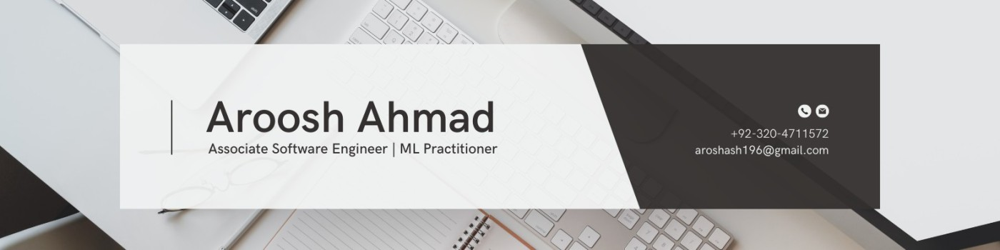

<h1 align="center">Hello there 👋, I'm Aroosh Ahmad</h1>
<h3 align="center">AI Specialist | .Net Core & .Net MVC Developer | React & Django Developer | Full Stack Web & AI Developer</h3>

---

👨‍💼 **Currently Working As:**
 
- Associate Software Developer at [Nodlays](https://www.nodlays.com)
 
---

🎓 **Education:**

- Huawei Certified AI Associate

---

💡 **About Me:**

Dynamic professional specialized in AI and web development. Leveraging a strong background in .NET, React, and Python to deliver cutting-edge web applications and innovative AI solutions. Proficient in machine learning, image classification, natural language processing, and regression through TensorFlow and Keras. Committed problem-solver delivering high-quality results within deadlines.

---

🛠 **Skills:**

- AI/ML: `TensorFlow` `Keras` `Scikit-Learn` `OpenCV`
- Web Development: `.NET Core` `.NET MVC` `React` `Django` `JavaScript` `HTML` `CSS`
- Databases: `MySQL Server` `MongoDB` `Azure` `PostgreSQL`

---

🖥 **Previous Experience:**

- Software Engineer at Highbit Games

---

📂 **Projects:**

- [Sensaware](http://www.sensaware.io/)
- [GoIndia](https://goindia.care/)

---

**Let's connect and discuss how we can collaborate to achieve your goals in web development and AI.**
